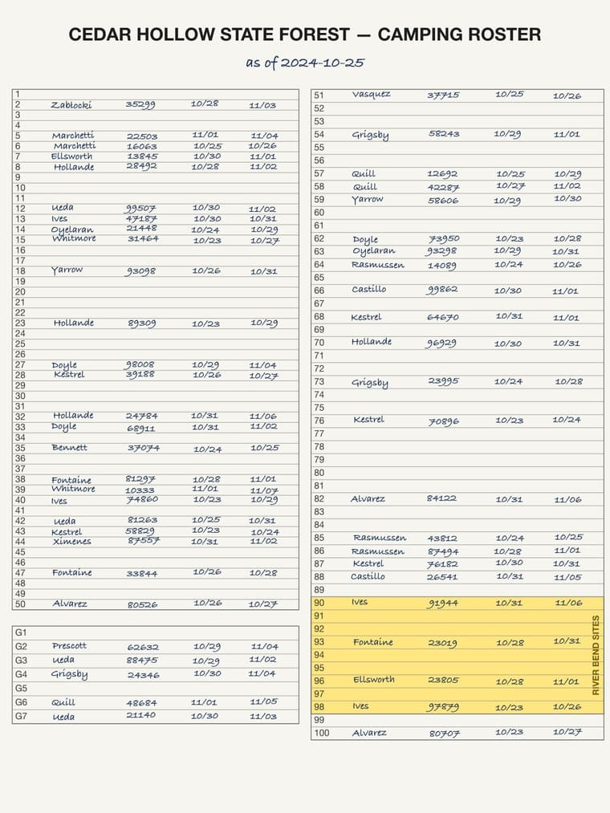
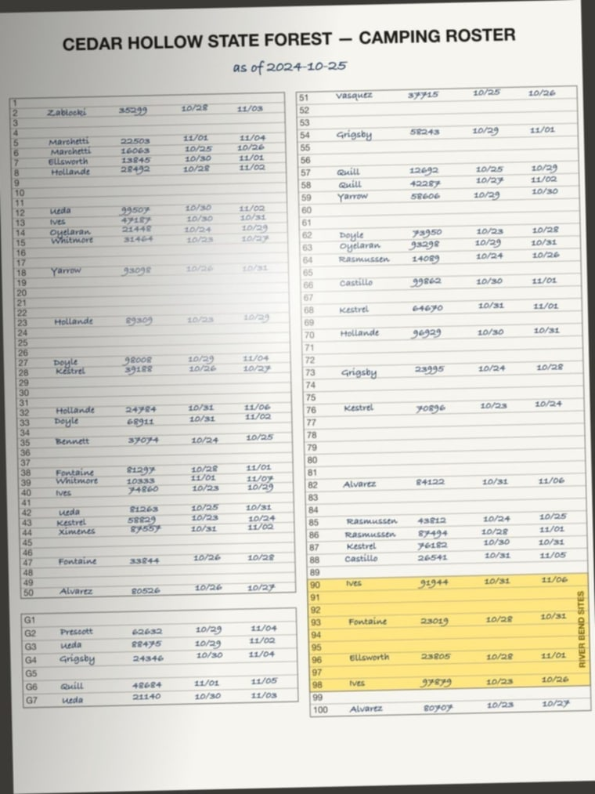
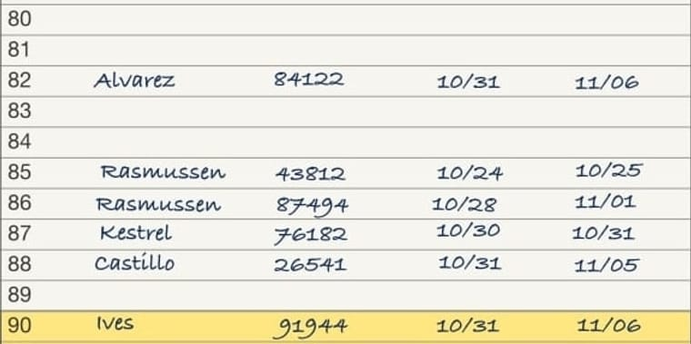
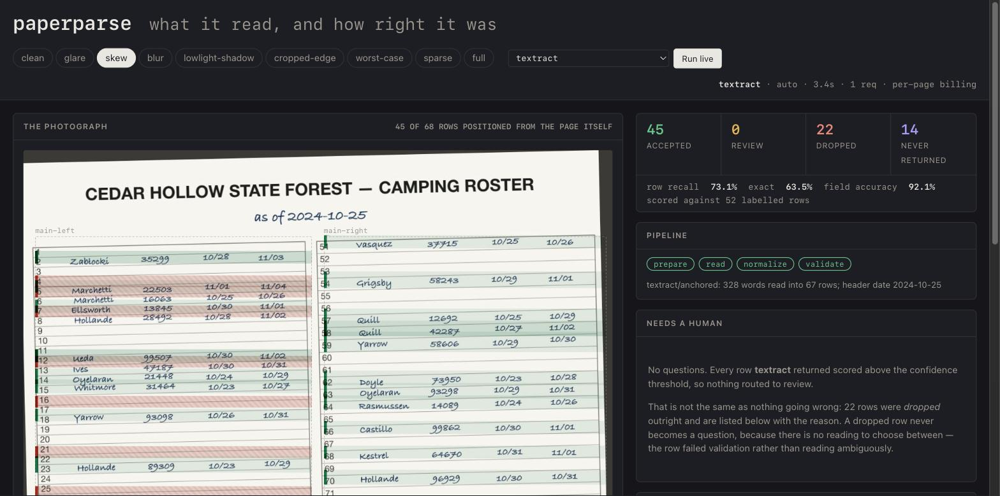

# paperparse

[](https://github.com/chrisrmullinsdesign/paperparse/actions/workflows/ci.yml)

Extract structured data from photographs of handwritten paper forms — two interchangeable backends, a human-review queue, PII redaction, and a reproducible eval harness that tells you which backend to use.

**[Open the viewer →](https://chrisrmullinsdesign.github.io/paperparse/)** — nine real recorded runs, the rows each one read, the rows it dropped and why, and a toggle that diffs every cell against the ground truth. No install, no key.

Built around one idea: **a form is data, not code.** You describe the physical artifact once, in a `FormSpec`, and the prompt, the crop geometry, the OCR-to-meaning mapping, the output schema, the validator, and the redaction pass all read from it. Supporting a new form means writing a spec, not editing the pipeline. Supporting a new *backend* means implementing one method.

| Backend | How it reads | Measured on the corpus below |
| --- | --- | --- |
| **Textract** | OCR words + boxes, rows anchored on the printed row number | 92.2% row recall, **99.9% field accuracy**, ~$0.015/page, **3.5s** |
| **Claude (vision)** | The image and a generated prompt | **99.6% row recall**, 100% field accuracy, $0.110/page, 31.6s |
| **Textract → Claude** | Textract first; the vision model re-reads only the doubtful rows | not re-measured since the anchoring change — see [below](#a-correction) |

Roughly: **Textract for throughput and cost, Claude for accuracy, escalation when volume makes the saving matter more than the last seven points of recall.** The harness exists so that sentence is a measurement rather than an opinion — and [it has caught this README being wrong](#a-correction) more than once.

---

## What it reads

<p align="center">
  
  
</p>

Left: a clean capture. Right: the same form with glare, skew, blur and a shadow gradient. Both are synthetic — generated by `fixtures/generate.ts`, which hands back the rows it wrote, so every image ships with a perfect label set.

---

## The problem this solves

Hand a vision model a photograph of a dense 100-row grid and ask it to transcribe every row. It will often return twenty plausible rows, a confident note, and no indication that it summarized instead of transcribing. Nothing in the response distinguishes that from success.

The theory behind this pipeline was that you can't prompt your way out of that reliably, because the failure is structural — a full-page grid *affords* summarization — so the fix is to remove the affordance by cropping the form into bands and reading ten rows at a time.

**The benchmark did not support that.** On the synthetic corpus, sectioning came last: 82% row recall against 98% for a single whole-page request, at thirteen requests instead of one. The numbers and what I think they mean are [below](#benchmarking). The machinery is still here, and still the right tool for a genuinely dense capture — but it is off by default, and the honest version of this README is one that says so.

```
photograph
   │
   ├─ prepare ........ strip EXIF, optional enhance, optional downscale
   │
   ├─ read ........... one whole-page request by default; split-in-half and
   │                   geometry-cropped modes available and measured
   │
   ├─ normalize ...... catch the two-digit-year slip before it looks like history
   │
   └─ validate ....... type-check fields, apply cross-field rules,
                       route low-confidence rows to review,
                       and record every drop with a reason
```

The argument for it is that there is no plausible summary of ten rows that isn't just the ten rows. The argument against it is the measurement.

---

## The FormSpec

A spec describes the physical form. Here is the part that does the work — the layout:

```ts
layout: {
  sectionChunkRows: 10,
  blocks: [
    { id: 'main-left',   keys: { from: 1,   to: 50  }, x: [0.02, 0.49], y: [0.11, 0.75], rowSlots: 50 },
    { id: 'river-bend',  keys: { from: 90,  to: 98  }, x: [0.51, 0.99], y: [0.734, 0.878], rowSlots: 9 },
    { id: 'main-right',  keys: { from: 51,  to: 100 }, x: [0.51, 0.99], y: [0.11, 0.91], rowSlots: 50 },
    { id: 'group-sites', keys: { from: 101, to: 107 }, x: [0.02, 0.49], y: [0.77, 0.89], rowSlots: 7 },
  ],
}
```

Three things in there are the whole design:

**Blocks resolve in declaration order, first match wins.** `river-bend` covers rows 90–98, which are numerically inside `main-right`'s 51–100 range. Declaring it first lets a visually distinct band take precedence over the column that contains it. Real forms are full of these.

**`rowSlots` is not the key count.** `main-right` declares 50 slots but only *resolves* 41 of them, because the band claims nine. Row pitch has to come from the slot count or every crop below row 51 drifts upward by a growing margin. This is the kind of thing that fails silently — the model reads whatever is in the frame and you get plausible rows attributed to the wrong keys.

**Chunking is derived, not written.** Two rules — never cross a block boundary, skip keys an earlier block claimed — reproduce, exactly, the chunk boundaries that were originally hand-tuned against a real form:

```
[1-10] [11-20] [21-30] [31-40] [41-50]        ← left column
[90-98]                                        ← the band
[51-60] [61-70] [71-80] [81-89] [99-100]       ← right column, split around the band
[101-107]                                      ← group block
```

Note `[81-89]` stopping at 89 and `[99-100]` picking up after: that falls out of the two rules. There's a test asserting exactly this list, because it's the argument for the abstraction.

---

## What's in here

| Area | What it does |
| --- | --- |
| `src/formspec/` | The spec type and the geometry engine — key → rect, rect → key, chunk derivation |
| `src/image/` | EXIF stripping, optional enhancement, cropping, portrait splitting with overlap-aware merge |
| `src/extract/` | The `Backend` interface; the Textract (geometric) and Anthropic (vision) backends; escalation; prompt + JSON-schema generation; section runner |
| `src/validate/` | Field typing, cross-field rules, confidence routing, two-digit-year correction |
| `src/eval/` | Multiset diff, precision/recall/F1, the benchmark harness, review-question generation |
| `src/redact/` | Locate and blur PII columns to produce a shareable copy of a form photograph |
| `examples/` | A worked spec for a 107-row campground roster |
| `fixtures/` | Synthetic form generator — images with ground truth, no API key needed |
| `ui/` | A viewer for one run: the sheet, what was read, what was dropped, and the review queue |
| `runs/` | Recorded runs, and the answers a reviewer gave. What the viewer reads |

---

## Quickstart

```bash
npm install
npm test                 # 174 tests, no API key required
npm run fixtures         # render the synthetic corpus to fixtures/out/
npm run ui               # the viewer, once you have recorded a run
```

Extract a single image. Either backend works — pick by whether you care more about cost or about the last seven points of recall:

```bash
# Geometric: needs AWS credentials with textract:AnalyzeDocument
npm run extract -- fixtures/out/clean.jpg --backend textract

# Vision
export ANTHROPIC_API_KEY=sk-ant-...
npm run extract -- fixtures/out/clean.jpg
```

```
Backend:   textract  (1 request)
Read mode: whole
Rows: 51 returned, 48 accepted, 3 dropped

Dropped:
  row 92: missing_required_field (date_in)
  row 94: missing_required_field (date_in)
  row 96: missing_required_field (date_in)

Confident (48):
    2  date_in=2024-10-25  date_out=2024-10-26
    3  date_in=2024-11-01  date_out=2024-11-05
    4  date_in=2024-10-30  date_out=2024-11-05
  ...
```

A real run against `fixtures/out/glare.jpg`. Note the three dropped rows: all in the highlighted band, all missing the same field. Every discarded row is accounted for with a reason, which is what makes a pattern like that visible instead of just showing up as a lower number — and rows shaped like these are exactly what `EscalatingBackend` sends to the vision model for a second look.

In code:

```ts
import { runPipeline, AnthropicBackend } from 'paperparse'
import { campgroundRosterSpec, campgroundRosterRules } from './examples/campground-roster/spec.js'

const result = await runPipeline(imageBuffer, campgroundRosterSpec, new AnthropicBackend(), {
  rules: campgroundRosterRules,
})

result.rows           // confident, validated, typed
result.uncertainRows  // the review queue
result.stats.drops    // every discarded row, with a reason
result.usage          // requests and tokens this cost
```

Or read it cheaply and spend the vision model only where the cheap reader struggled:

```ts
import { TextractBackend, EscalatingBackend, AnthropicBackend } from 'paperparse'

const backend = new EscalatingBackend(new TextractBackend(), new AnthropicBackend())
```

---

## Seeing what the model sees

Misaligned crops are the most likely thing to go wrong in a new spec, and they fail quietly. So look at them:

```bash
npx tsx scripts/debug-crops.ts fixtures/out/clean.jpg
```

Writes one JPEG per chunk to `fixtures/crops/`. Each carries one row of overlap on either side, so a row sitting on a chunk boundary is fully visible to at least one pass rather than half-visible to two.

<p align="center">
  
</p>

That's the crop for rows 81–89 — one request's entire view. Row 80 above and row 90 below are the overlap; the printed row numbers stay in frame so the model can anchor each line to a key rather than counting from the top of the crop.

---

## Seeing the whole run

`debug-crops.ts` shows you one request's view. This shows you the run:

```bash
npm run fixtures
npm run record -- --backend textract    # spends real requests, once
npm run ui                              # → localhost:5173
```

The same page is published from `runs/` on every push, which is the whole deployment:
`ui/index.html` and the committed records copied into place. No build, no bundler, and
nothing in the published site that isn't also in the repository.

<p align="center">
  
</p>

One page, no framework, no build step. The sheet on the left with every row banded by
what happened to it — accepted, held for review, dropped with a reason, or never
returned at all. The rows on the right, hover-linked in both directions. The review
queue as a stack of answerable questions, each with the actual pixels attached and a
keypress per answer.

That screenshot is a real Textract run on `skew`, and it argues the repo's central point
without a paragraph: **the dashed block outlines are the FormSpec's declared coordinates
and they sit square to the image, while the green bands tilt with the photographed
paper.** The bands are drawn from the boxes the backend actually read each row's cells
from, so they follow the sheet rather than the spec. The eleven hatched red bands are the
dropped rows, and because nothing measured those, they are drawn at declared coordinates
— you can see them fail to line up. That mismatch is the whole argument for anchoring.

Two things it does that a demo of an extractor usually can't:

**It shows you the rows that aren't there.** A row the parser never returned leaves no
trace in its own output — it isn't in `rows`, it isn't in `uncertainRows`, and it isn't
in `stats.drops`. It exists only by comparison with the labels. The corpus is generated,
so the labels exist, so the fourth category can be drawn. That category is the one a
demo normally hides.

**It can be wrong out loud.** `compare to truth` diffs every cell against the generator's
gold data and marks the ones that disagree, using the same `multisetDiff` the benchmark
uses. Toggle it on and the run stops being a list of plausible values.

The crop the review queue shows is the *cell*, not the row, whenever the backend reports
coordinates — which is Textract's real advantage over a vision model made visible. Ask
the vision backend the same question and you get the whole row, because a vision model
genuinely does not know where on the paper it looked. The viewer says so rather than
guessing a box.

**There is no simulated mode, and `runs/` ships empty.** The viewer reads real recorded
runs or it shows you how to make one. A fabricated run in this repo would undo the only
thing the repo is arguing.

The tradeoff of no build step is that `ui/index.html` is plain JavaScript and is not
typechecked; the TypeScript either side of it — `ui/server.ts`, `ui/record.ts` — is, and
is tested. The viewer computes no geometry of its own: row rectangles arrive precomputed
from `rectForKey`, so there is no second implementation of the layout maths to drift.

### Answers have to go somewhere

A review queue that forgets on refresh is a demo of a review queue. Answers are written
to `runs/<id>.review.json`, and folding them back into the rows is a command:

```bash
npm run review -- clean
```

It reports what the answers changed, and rescores:

```
<run> — <n> of <n> questions answered
  <n> corrected, <n> skipped, <n> rows changed
  review queue: <n> → <n>

Scored against the generator's labels:
  row recall      <before> → <after>
  exact match     <before> → <after>
  field accuracy  <before> → <after>
```

The shape, not a recorded result — the numbers depend on which rows your run left
uncertain and what the reviewer said, so quoting a figure here would be inventing one.
Run it and read your own.

Three things in the design are deliberate:

**Review is scored, not asserted.** "A human checked it" is unfalsifiable. The same
`multisetDiff` the benchmark uses runs over the corrected rows, so the value of review
is a number on the same scale as everything else in this README.

**It can report that review made things worse**, and names the rows where the answers
disagreed with the labels. A reviewer squinting at a blurred cell is a better source than
the model's self-report, not an infallible one. A loop that only ever reports improvement
is not measuring anything.

**A skip is not agreement.** A reviewer who skips is saying "I can't tell either", which
is different from confirming the parser — so the row keeps its value and stays exactly as
uncertain as it was. Only an explicit choice corrects a row and clears it from the queue.

---

## Benchmarking

The harness runs a labelled corpus through several configurations and reports comparable numbers:

```bash
npm run fixtures
npm run bench -- --limit 3            # start small; this spends real tokens
npm run bench                         # whole vs. split vs. sections
npm run bench -- --textract --modes whole   # add the geometric backend
```

All figures below: the 9-image synthetic corpus, 488 gold rows, Claude Opus 5 at `effort: high`, single pass.

**Read modes, vision backend**

| Configuration | Row recall | Row precision | Exact F1 | Field accuracy | Requests | Cost / image | Avg / image |
| --- | --- | --- | --- | --- | --- | --- | --- |
| anthropic / whole | 98.2% | 98.2% | 95.5% | 97.6% | 1 | $0.119 | 36.4s |
| anthropic / split | 93.9% | 100.0% | 96.8% | 100.0% | 2 | $0.135 | 24.7s |
| anthropic / sections | 82.4% | 97.8% | 87.2% | 97.9% | 13 | $0.315 | 37.6s |

**Backends, whole-page**

| Configuration | Row recall | Row precision | Exact F1 | Field accuracy | Requests | Cost / image | Avg / image |
| --- | --- | --- | --- | --- | --- | --- | --- |
| anthropic / whole | 99.6% | 99.6% | 99.6% | 100.0% | 1 | $0.110 | 31.6s |
| textract / whole | 92.2% | 99.6% | 95.5% | 99.9% | 1 | ~$0.015 † | **3.5s** |
| textract → anthropic / escalate | *stale* ‡ | | | | 2 | $0.064 | 22.5s |

† The harness prices tokens; Textract bills per page. Its cost column reads `$0.000` because the number it knows is genuinely zero — the ~$0.015 is the published `AnalyzeDocument` TABLES rate, quoted here rather than computed.

Reproduce with `npm run bench -- --textract --modes whole`.

### What the numbers say

**Sectioning lost, and it was the hypothesis this repo was built on.** Worst recall of the three read modes, 2.6× the cost, thirteen requests against one. Two things plausibly explain it, and I can only argue for the first: the crops are small, and a model reading ten rows in isolation appears to hedge — 97.8% precision against 82.4% recall is the signature of dropping rows it isn't sure about rather than misreading them. The second is that these are *clean synthetic renders*, and the summarization failure that motivated sectioning may simply not occur on them. The technique was originally developed against real phone photographs of a real clipboard — glare, angle, thumb over the corner. **That is a limitation of this corpus, not a vindication of the technique.** Testing it needs real photographs and a real gold set, which this repo does not have.

**A cheap geometric backend is closer than expected.** Textract gives up ~7 points of recall and returns in 3.5 seconds instead of 32, at roughly an eighth of the cost, at 99.9% field accuracy once partial dates are resolved against the header — one wrong field in 1,047. Nearly everything it got, it got right. For a high-volume pipeline that ratio is hard to argue with. Most of the remaining recall gap is one image: `cropped-edge` scores 44.6% because rows are genuinely outside the frame, and the other eight average 98.5%.

**Escalation's numbers are stale and are not repeated here.** They were measured when Textract resolved rows positionally, and escalation triggers on *how many rows the primary returned incomplete* — so changing how the primary assembles rows changes what escalates. The old figures (95.1% recall at $0.064) described a different primary. Re-measuring needs an Anthropic key, which the machine that recorded these runs did not have. Reporting them as current would be exactly the kind of claim the rest of this README is written to avoid.

**How escalation had to be fixed is the more interesting result.** The first version triggered on low confidence, which did *nothing at all* — identical scores, double the cost. The diagnosis: of 488 gold rows, Textract returned 30 with low confidence and got every one of them right, while losing recall on 8 rows it returned with a *field missing* and 4 it never returned. Confidence was measuring the wrong thing. Escalation now also triggers on a missing required field, which is where the 1.7 points came from. A half-read row turns out to be a better signal than a hedged one — and no amount of reasoning about it would have been as quick as measuring it.

**Run-to-run variance is real and worth stating.** `anthropic / whole` scored 98.2%, 100.0% and 99.6% across three runs of the identical corpus; a single image measured 100% / 80.8% / 100% recall across three runs. These are single-pass numbers, not averages over repeats. Treat differences under a couple of points as noise — including the ones in these tables. Textract, by contrast, returns the same answer every time, which is its own kind of value.

### A correction

The numbers above replace earlier ones, and how they were wrong is worth stating.

The published Textract figures — 93.4% recall, 100% field accuracy — were measured
when the backend resolved rows **positionally**, against declared coordinates. A later
commit made **anchored** the default, because anchoring is the only thing that survives
a photograph, and introduced a bound on how far right of the row number a row's cells
may sit: `reach`, a constant, 0.34.

The blocks on the worked example are 0.47 wide. The rightmost column sits at 0.438.
Every row lost its last cell, every row therefore failed `missing_required_field`, and
the validator dropped all of them. **On the corpus, the default backend scored zero.**

Three things about that are worth more than the fix:

- **The benchmark was never re-run after the default changed.** The README kept quoting
  a measurement of a code path that was no longer the one anyone would execute. Numbers
  do not stay true just because they were true when recorded.
- **The test suite passed the whole time.** Every anchoring test built its rows from
  hand-picked offsets, and all of them happened to fall inside 0.34. Nothing exercised a
  row laid out at the coordinates the FormSpec actually declares — so the tests agreed
  with the code and both were wrong about the form.
- **The failure was invisible from inside the component.** Anchoring did its job
  perfectly: it found every gutter, fitted every line, resolved every row key. The rows
  simply came back one cell short, and the damage surfaced two stages later as a
  validation drop. A component can be correct and still be wrong about its inputs.

`reach` is no longer a constant. It is the widest block the spec declares, because a
row cannot extend past the block that contains it — and unlike a tuned number, that is
right for every form rather than for the one it was tuned on. The regression test builds
a page at the spec's own declared columns and fails on the old constant.

The escalation row is marked stale rather than corrected, because escalation triggers on
incomplete rows from the primary and the primary's assembly changed underneath it. That
one needs a live re-run, not an edit.

**‡** Everything in these tables is recomputed from the recorded runs committed in
`runs/`, pooled the way `bench.ts` pools them. You do not have to trust the numbers:
`runs/*.json` carries the rows, the labels, and the diffs they were computed from.

---

### Reading rows without trusting the coordinates

The geometric backend has two ways to turn OCR output into rows, and the difference matters more than anything else in this repo.

**`positional`** tests each word's centre against the spec's declared geometry. It is simple and it works on scans. On a photograph it does not, and the failure is quiet — a coordinate test always resolves *some* row, just not the printed one.

**`anchored`** (the default) ignores the declared coordinates entirely. It finds the printed row-number column in the OCR output, fits `rx = a + b·cy` through it to measure the page's keystone *from the paper itself*, and takes each row's cells from the band around its own anchor. Fields are assigned by reading order and token type rather than by x-window.

Three measured facts make this not a refinement but the only thing that can work:

| | Measured |
| --- | --- |
| Keystone drift of the printed gutter, top to bottom | ~0.024 in x |
| Row pitch across 41 real sheets | 0.0090 – 0.0166 — a **1.8× spread**, so no declared constant serves |
| Printed row numbers | **Not contiguous.** A real roster prints `51, 52, 53, 55, 56, 64, 65…` |

That last one is fatal on its own. `key = first + slot` isn't mistuned, it's the wrong model of the form, and no coordinate adjustment repairs it. Anchoring reads the number instead of computing it, so gaps are simply not an event.

Two details carry more weight than they look:

- **Bin candidates on the right edge, not the centre.** The printed column is right-aligned, so `7` and `47` share a right edge but not a centre; centre-binning splits one gutter into two and neither half clears the anchor threshold.
- **Select the gutter by longest strictly-ascending run, not by token count.** A "number of people" column is also a vertical stack of small integers and can outnumber the real gutter — but its values don't ascend down the page. This is what isolates the row index with no layout knowledge at all.

### Validated on real photographs

Everything else in this README is measured on synthetic renders. This part is not.

Replayed against **41 real clipboard photographs** — five years of form revisions, 12–24 MP camera originals alongside 1.5 MP social-media re-encodes:

| | Result |
| --- | --- |
| Both printed gutters located | **41 / 41** |
| Line-fit residual (RMS) | median **0.0008**; 40 of 41 at ≤ 0.0014 |
| Worst case | 0.0155, on one 2022 sheet |
| Rows anchored | 1,524 across the corpus |

**This validates registration, not accuracy.** A fit's own residuals tell you whether the page registered without anyone knowing the right answers — which is why it can run over an unlabelled corpus. What rows *say* is a separate question needing labelled sheets, and those photographs contain real personal data, so neither they nor their labels are in this repo. The synthetic corpus is what ships.

### How it scores

- **Multiset, not set.** A row emitted three times is a different mistake from a row emitted once. Counting with multiplicity captures both.
- **Two diffs, reported separately.** Key-only ("did we find the row") and exact ("did we read it right") fail for different reasons and have different fixes — chunking versus crop quality.
- **Undefined metrics are `null`, not `0`.** A parser that returned nothing has undefined precision, not perfect precision and not zero. Collapsing that produces averages that quietly lie about the empty cases.
- **Micro-averaged.** Pooled over rows, so a sparse 3-row form doesn't move the number as much as a full 100-row one.
- **Uncertain rows are scored.** They're a routing decision, not a claim of wrongness. Excluding them would flatter precision by hiding the parser's own hedges from the measurement.

The same `multisetDiff` serves the review UI, comparing parser output to human-approved rows — so offline benchmark numbers and production correction rates are computed on identical arithmetic and can be compared directly.

---

## Fixtures are synthetic, deliberately

The generator renders fake filled-in forms and hands back the rows it wrote, so every image comes with a perfect label set and the benchmark is reproducible from a clean clone.

Synthetic rather than redacted real forms, for two reasons. Redaction is a claim you have to defend every time you publish; synthesis isn't a claim at all. And a generator can target specific failure modes on demand:

```bash
# fixtures/out/ — clean, sparse, full, glare, skew, blur,
#                 lowlight-shadow, cropped-edge, worst-case
```

It renders from the same `FormSpec` the pipeline reads, so generated rows land exactly where `rectForKey` expects them. If a crop is misaligned, the bug is in the geometry — not in a disagreement between two hand-maintained coordinate sets.

---

## Notes on the model integration

- **Structured outputs, not prose parsing.** The JSON schema is generated from the spec, so there's no fenced-JSON extraction step and no retry-on-parse-failure loop. `src/extract/json.ts` survives as a fallback for backends without schema enforcement.
- **Range checks live in the validator, not the schema.** A schema rejection loses the whole response; the validator drops one row and tells you which.
- **Streaming, always.** Not for UI — `max_tokens` has to cover thinking plus a form's worth of JSON, and at those values a non-streaming request risks an HTTP timeout.
- **Refusals are checked before reading content.** Safety classifiers return a normal 200 with an empty `content`, so indexing `content[0]` unconditionally throws.
- **Prompts are written at normal volume.** No `CRITICAL:` / `YOU MUST` stacking — current models follow instructions closely enough that the emphasis older models needed now over-applies, pushing the model toward reporting rows it half-guessed. There's a test asserting the generated prompt stays clear of it.
- **PII never reaches the output.** Fields marked `pii` are excluded from the prompt *and* from the generated schema *and* stripped by the validator even if a backend returns them anyway. Three layers, because the first two are the model's to honor and the third isn't.

---

## Prior art, and when not to use this

This is not a general-purpose document extractor, and for most form-extraction problems it is the wrong tool.

**Reach for something else when the layout is unknown or varies.** AWS Textract, Azure Document Intelligence and Google Document AI detect tables and form fields automatically, are trained on enormous handwriting corpora, and return per-word confidence and bounding boxes. On the open-source side, [Surya](https://github.com/datalab-to/surya), [Docling](https://github.com/docling-project/docling) and [Marker](https://github.com/datalab-to/marker) do layout analysis and table-structure recognition; render-the-page-and-ask-a-vision-model tools cover the general case with far less setup. All of them will get you further, faster, on an arbitrary document.

paperparse assumes the opposite situation: **one form, whose layout you know, that you process a lot of.** That assumption is the whole design. It's what lets the pipeline crop to a band it can name, reject a row that violates a rule the form guarantees, and score itself against a gold set. A generic extractor will find you a table; it won't know that rows 90–98 are the River Bend band, that G4 means key 104, or that a 40-night stay is impossible on this sheet. Those priors are what turn a plausible transcription into a checkable one.

Known gaps, stated plainly: no PDF or multi-page support, no table-structure detection, and one worked example. Row geometry is no longer hand-authored for the geometric backend — see *Reading rows without trusting the coordinates* — but column semantics and the vision path's crop geometry still are. It has not been benchmarked against any of the tools above — the numbers in this README compare *its own read modes* to each other, nothing more.

**The obvious next thing** is a second backend built on a document-AI service rather than a vision model — Textract's `TABLES` mode, say. On a printed grid it returns cell structure natively, costs roughly an order of magnitude less per page, and gives *calibrated per-word confidence with bounding boxes*, where a vision model gives you a self-report that can be confidently wrong. That last point is the interesting one: it would make the review queue meaningfully better, because you could highlight the exact cell rather than the row.

The likely end state isn't one or the other but cheap deterministic extraction with the vision model escalated to only for low-confidence cells. `Backend` exists so that comparison can be run rather than argued about — same gold set, same metrics, same table.

---

## Security

This library's whole job is decoding images from untrusted sources, so the image decoder is part of the attack surface, not just a dependency.

- **`sharp` is pinned to `>=0.35.3`** ([GHSA-f88m-g3jw-g9cj](https://github.com/advisories/GHSA-f88m-g3jw-g9cj), CVSS 7.0 — four inherited libvips CVEs affecting `sharp < 0.35.0`, with high integrity and availability impact when processing untrusted input). Don't relax that floor.
- **`npm audit` reports zero vulnerabilities** as committed.
- **Validate format before decoding.** This library does not sniff magic bytes for you — it assumes you hand it an image you already vetted. If you're accepting uploads, check the actual bytes (not the client-declared MIME type) against a narrow allowlist before calling in. The advisory's own suggested mitigation is blocking the GIF, TIFF and VIPS decoders via `sharp.block()`; an allowlist of JPEG/PNG/WebP/HEIC achieves the same thing at the boundary.
- **EXIF is stripped on the way in.** `prepareForVision` re-encodes and drops all metadata, baking in rotation first so the orientation flag isn't lost with it. Phone photos carry GPS coordinates and device identifiers; that should go before the image is stored, logged, or shown to anyone.
- **The viewer serves the repo, so it binds loopback only.** `npm run ui` hands out
  files from the repository directory over plain HTTP with no authentication, which is
  fine on `127.0.0.1` and would not be on `0.0.0.0` — Node's default. Path traversal is
  blocked separately: a request resolves inside the repo root or it 404s. Override the
  bind with `HOST` if you know why you want to.
- **Redaction is model-located, so treat it as a draft.** `redactImage` is best-effort, not a guarantee. For anything with real consequences, have a human check the output — or don't publish the image.

---

## Honesty about what's verified

- **174 tests, no network.** Geometry (forward and inverse), chunk derivation, validation, year correction, partial-date resolution, diff/metrics, review-question generation, prompt and schema construction, split merging, Textract word placement, cell provenance, pipeline stage events, review-answer application, the anchoring reach bound, the viewer's record builder, the local server's path-traversal guard, escalation routing, and the full pipeline against a stub backend that answers from the generator's own ground truth.
- **Both backends have been run against their live APIs**, as has the redaction pass. The numbers in the benchmark tables are recorded runs, not estimates.
- **The Textract numbers were re-measured after a bug that made them meaningless.**
  See [*A correction*](#a-correction). The figures published before that described the
  positional path while the default was anchored, and the anchored default was scoring
  zero. The recorded runs behind the current numbers are committed in `runs/`, so the
  tables can be recomputed rather than believed.
- **The escalation row is stale and marked as such**, not quietly carried forward.
- **Every number here is a single pass over 9 synthetic images.** Not averaged over repeats, and the same configuration has moved ~2 points between runs. Differences of a few points are noise.
- **The corpus is synthetic and clean.** That is what makes it reproducible, and it is also its main limitation — see the sectioning discussion above. One exception: anchored registration was replayed against 41 real photographs (above), but those sheets carry personal data and are not in this repo, and the replay validates registration rather than accuracy.
- **Not measured against any other tool.** See *Prior art* above.

---

## Adding a form

1. Write a `FormSpec` — describe the artifact in prose, declare the row key and fields, mark PII, lay out the blocks.
2. Run `debug-crops.ts` against a photo and look at every crop.
3. Add cross-field rules as `RowRule`s if the form has constraints the schema can't express.
4. Generate or label a small corpus and run the benchmark before trusting it.

Step 2 is not optional. Everything downstream assumes the geometry is right, and wrong geometry produces confident, plausible, wrong output.

---

## License

MIT
